# Extensibility: Advanced Flow

### Introduction


This lab walks you through the steps to extend Procurement Command Center by adding a new dashboard for local agreements.


Estimated Time: 45 minutes

### Objectives
In this lab, you will:
* Create a new Dataset
* Create metadata attributes for the dataset
* Update metadata attributes and create attribute groups
* Assign dataset to the application
* Execute data load for the new dataset
* Extend the existing dashboard with required components


### Prerequisites

This lab assumes you have:
* Completed all previous labs successfully 

##  

## Task 1:	Create a new dataset

**Goal**: Extend Procurement command center to add a new dashboard for local agreements. Currently, Procurement command center supports only global BPA coverage.

**Create a Data set**

A data set is both a logical and a physical grouping of attributes to support business dashboard operations and use cases. From a logical perspective, it is designed to support several use cases that are accessed through one or more Oracle Enterprise Command Center Framework dashboards. The design typically caters to open‐ended interaction with the underlying data.


At the physical level, the data set stores one or more records with a uniquely identifying key that represents a particular level of detail of the entity stored in the enterprise system. Unique key is used to identify records and data sets.
* ECC\_SPEC\_ID column is unique and single assigned. Also, ECC\_SPEC\_ID must be of "spec" profile type.


Contents of a data set can be exported with attribute keys and attribute display names as headers. Each attribute stored in the data set is controlled by metadata properties that specify its behavior on the user interface. Additional value-add features such as calculations, bucketing, and precedence rules can also be specified.
        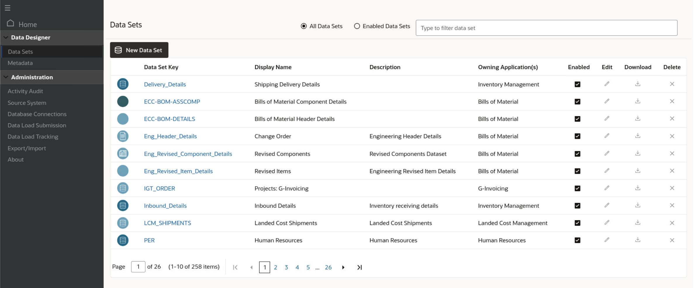

To create a data set within ECC, follow the below steps:

1. Login to EBS apps (Navigate to http://apps.example.com:8000) with below credentials
     ```
  	 Username: sysadmin
Password: welcome1
    ```
2.	Navigate to ECC Developer page -> ECC Developer
        
3.	Go to “Datasets” menu under “Data Designer” section
        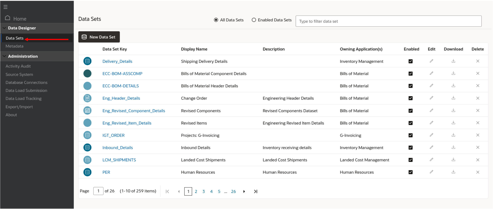
4.	Click on “New Dataset” button
        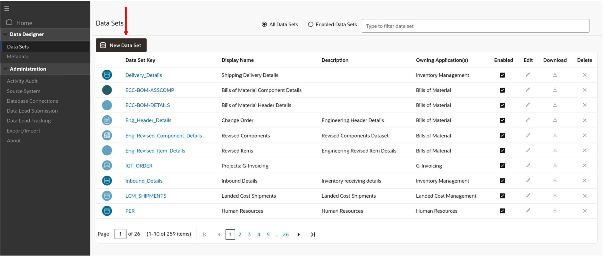
5.	Provide the below details:
    *	Dataset Key: 
                                                                ```
  	    <copy>xx-po-pcc-local-agreements</copy>
            ```
    *	Dataset Name: 
                                                                    ```
  	    <copy>XX PCC Local Agreements</copy>
            ```
    *	Icon: Procurement


6. Now, provide the security handler details using “Security Rules”. There are 2 different security types under security rules, which will provide security to the dataset:
    * Privilege
        
        * To access data of an ECC data set, the user must have at least one data set privileges (which is an Oracle EBS form function).
      

    * Security Handler
        * Once access to the data set is verified by the ECC Security Manager, a security handler is applied for any subsequent query against that data set to ensure that the data access is restricted to the subset, the user is allowed to see.
        * This is the level of security that enforces data access restrictions on data displayed in the dashboard based on the setups available in Oracle EBS that may be applicable to different business dashboards.
        * ECC allows configuration of custom security that is applied on the existing security handler. 

        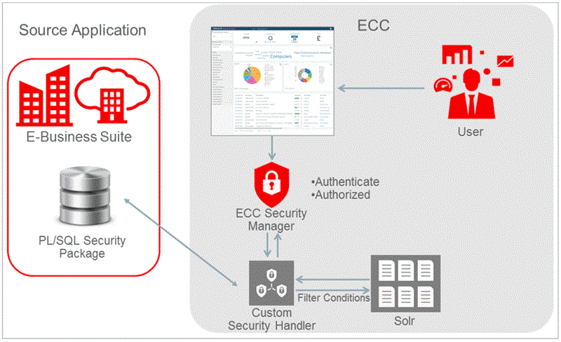


7.	At the time of creating the dataset, the security handler and privilege details are mandatory. We have pre-created the Security Handler and Privilege for you to directly use in this task, there is a separate task towards the end of the Lab which details the steps needed to create both Security Handler and Privilege from scratch.


7.	Click on “Security Rule” tab and provide below details:
    *	Security Handler Name: 
            ```
  	    <copy>XX_PO_PCC_DATASECURITY_PKG_PUB.GetFilterAttributeValuesPO</copy>
            ```
    *   Privilege(1): 
             ```
  	    <copy>XX_PO_PCC_ECC_LOCAL_AGREEMENTS</copy>
            ```
        

9.	Click on "Save" button. The new dataset has been created successfully.
        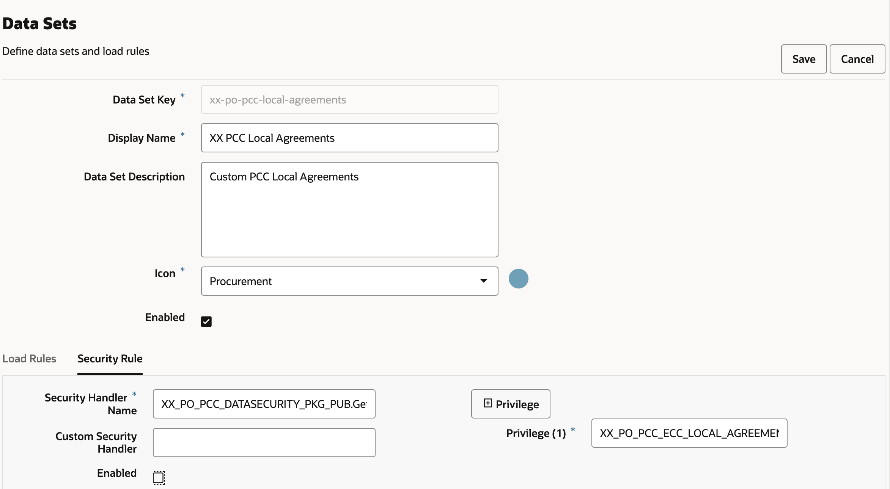 
## Task 2:	Create metadata attributes

**Attribute Metadata**
</br>
Attribute metadata section helps you define an attribute's characteristics, including:

* Attribute Key and type.

* Display name.

* Configuration parameters. For example, whether an attribute is searchable.

* Navigability settings. For example, whether to show record counts for available refinements, whether to enable multi-select and how to sort refinements.


1.	In ECC Developer page, go to “Metadata” menu under “Data Designer” section
2.	Choose the dataset from the dropdown as “XX PCC Local Agreements”
        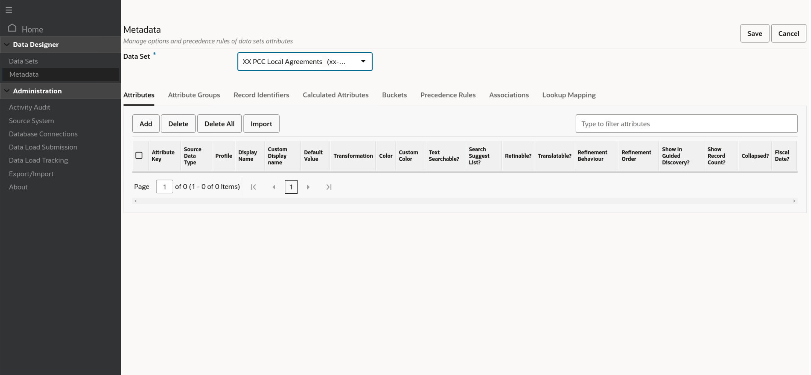 
    *	You will be on the “Attributes” tab
    *   Click on the “Import” button
        *	Connection: ebsdb
        *   Type: Describe
        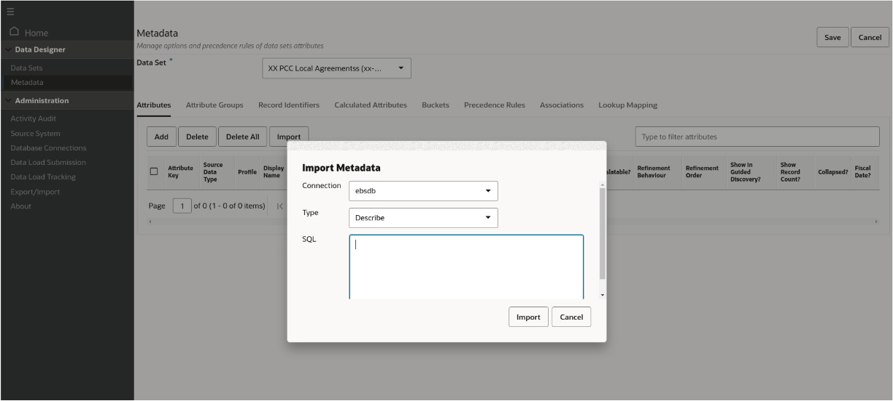 

        *   SQL: /u01/live\_labs/11470/lab\_files/lab5/task2/Local\_Agreements\_Query.sql


3.	Click on the “Import” button to create metadata attributes
        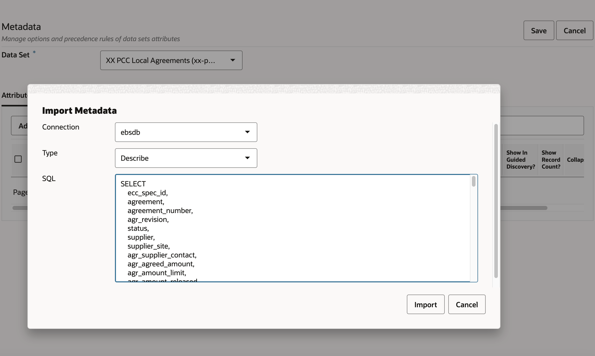 


4. Perform the below changes in the metadata attributes section
    *   Review the profile for all the attributes
    *	Change the profile of the below attributes:
        * DOC\_AUTHORIZED\_USER\_IDS to “strings”
        * ORDER_NUM to “strings”


         


    * Enable “Show in Guided Discovery?” checkbox for below attributes:
        * AGREEMENT
        * STATUS
        * SUPPLIER
        * SUPPLIER_SITE
        * BUYER_NAME
        * EFFECTIVE_FROM
        * EFFECTIVE_TO
        * LINE_STATUS
        * ORDER_NUM
        * SUB_STATUS
        * GROUP_STATUS
        * DOCUMENT_TYPE
        * RELEASE_NUMBER
    * Click on "Save" 

**Attribute Groups** </br>
Attribute Groups are logical groupings of attributes for display purposes based on functional/business meaning. They reduce clutter on Available Refinements and Results Table components.

Attribute Groups are defined at the data set level, where each data set can have zero or more attribute groups, and each group can have zero or more attributes. Groups can be designed at design time in the Administration UI or during runtime in metadata load phase.

5.	Define the below “Attribute Groups” and add attributes as listed below:
    * Navigate to “Attribute Groups” tab
    * Click on the “Add” button to create a new group
    * Provide below details:
        * Sequence #: 1
        * Group Key: PO_RELEASE
        * Group Name: Releases
    * Attributes:
        * PO\_UNIT\_PRICE
        * PO\_NEED\_BY\_DATE
        * PO\_PROMISED\_DATE
        * PO\_SHIP\_TO\_LOCATION
        * PO\_SHIP\_ORDERED\_QUANTITY

        

    * Similarly, add the below groups as well:
        * “Release Quantity” Group
            * Sequence #: 2
            * Group Key: PO\_RELEASE\_QTY
            * Group Name: Release Quantity
            * Attributes:
                * PO_SHIP\_ORDERED\_QUANTITY
                * PO_SHIP\_RECEIVED\_QUANTITY
                * PO_SHIP\_REJECTED\_QUANTITY
                * PO_SHIP\_INVOICED\_QUANTITY
                * PO_SHIP\_CANCELLED\_QUANTITY

        * “Release Amount” Group
            * Sequence #: 3
            * Group Key: PO\_RELEASE\_AMT
            * Group Name: Release Amount
            * Attributes:
                * PO\_SHIP\_ORDERED\_AMOUNT
                * PO\_SHIP\_SHIPPED\_AMOUNT
                * PO\_SHIP\_RECEIVED\_AMOUNT
                * PO\_SHIP\_REJECTED\_AMOUNT
                * PO\_SHIP\_INVOICED\_AMOUNT

            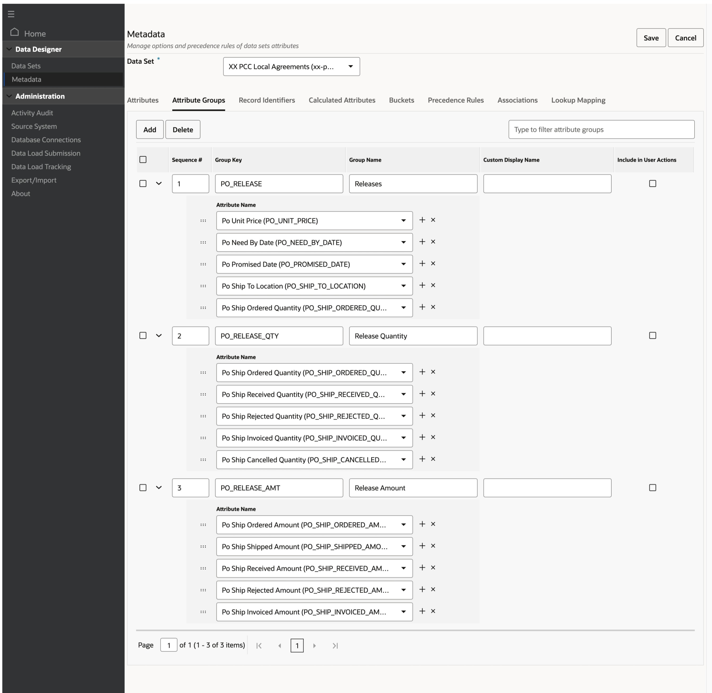

    * Click on “Save” button

**Associations** </br>
Associations allow explicit connection between two data sets by defining a link between a common attribute across the data sets. Oracle Enterprise Command Center Framework utilizes this information to enforce associative filtering of data in one destination data set based on refinement state in a source data set.

Additionally, Oracle Enterprise Command Center Framework establishes an implicit relationship between two different data sets that are both associated with a shared data set but not directly linked with each other. This advanced capability allows for advanced refinement state inheritance between data sets that are not directly associated with each other.

6.	Define the below “Associations”:
    * Navigate to “Associations” tab
    * Click on the “Add” button
    * Provide the below details to add association with “PCC Purchase Orders” dataset
        * Source Dataset: XX PCC Local Agreements
        * Source Attribute: Agreement
        * Target Dataset: PCC Purchase Orders
        * Target Attribute: SOURCE\_HEADER\_ID
        * Click on the “Save” button

            


## Task 3:	Assign data set to an application and execute data load

1. Go to ECC Developer home page
2. Search for “Procurement” application
3. Click on the edit icon for the application
4. Assign the dataset “XX PCC Local Agreements” to the application
                                                                    ```
  	    <copy>XX PCC Local Agreements</copy>
            ```
5. Click on the “Save” button
         

6. Execute data loads for this new dataset
    * Navigate to “Data Load Submission” menu under “Administration” section
    * Select the below details to submit “Query load”
        * Application Name: Procurement
        * Dataset: XX PCC Local Agreements
        * Load Type: Query Load
        * Connection: ebsdb
        * SQL Query: /u01/live\_labs/11470/lab\_files/lab5/task2/Local\_Agreements\_Query.sql
        * Data Upload: Select “Dataset Reset”
        </br>
        **Note:** Data set reset would wipe away any prior data set with the same name and start fresh whereas an extend existing data set option would use the same existing data set and ingest data on top of it
        * Click on the “Submit” button
        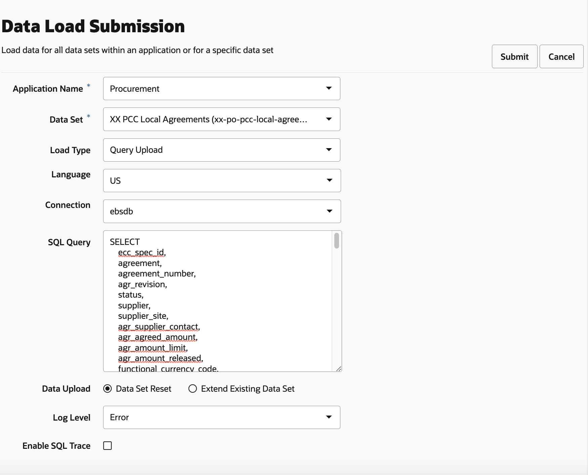 
    * Once the data load has been submitted, a "Run ID" will be generated
        

    * Upon clicking on the "Run ID" link displayed in the above image, user will be navigated to the  data load tracking page 
6.	You can also manually navigate to the data load tracking page from menu under “Administration” section
    * Refine using the request ID which is generated when data load is submitted
    * Click on the “Filter” button
        

7. Once the data load request is completed, the status of the data load will change from “RUNNING” to “SUCCESS”
        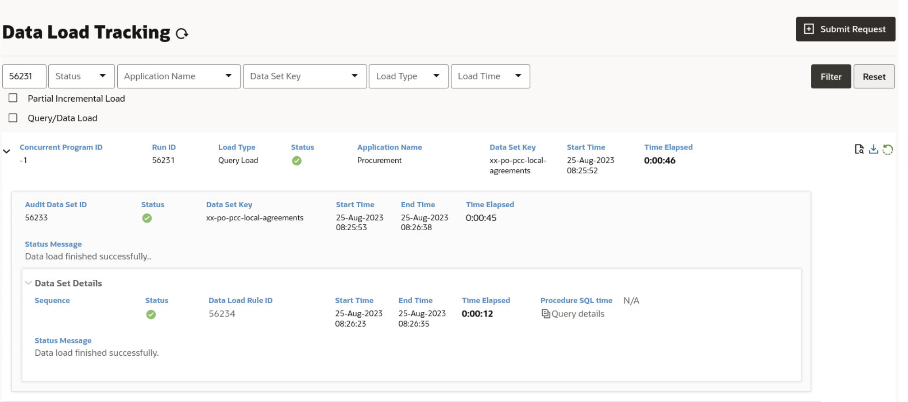

8. Click on the “Query Details” link to view more details:
    * **SQL Time:** This refers to the time spent for SQL per dataset
    * **Elapsed Time:** Total time for ingesting data into ECC (including SQL Time)
    * **Processed Rows:** Number of rows/records which are processed by ECC framework to start ingesting into ECC
    * **Successful Rows:** Number of rows/records which are successfully ingested into ECC
    * **Failed Rows:** Number of rows/records which are failed to ingest into ECC

        


## Task 4:	Extend existing dashboard

1. Navigate to ECC Developer home page
2. Search for “Procurement” application
3. Click on “Copy” option for “Agreements” dashboard
        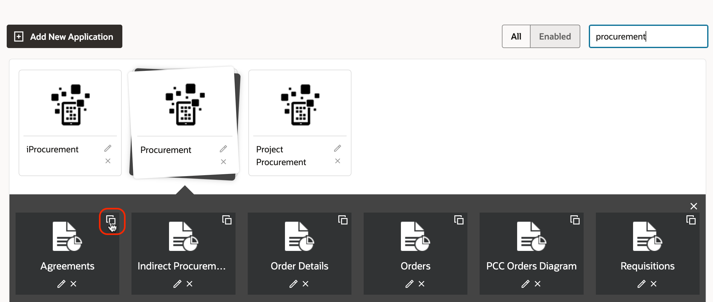 

4.	A new copied page is created as “Agreements(1)”
5.	For the copied page, change the details as mentioned below:
    * Page Short Name: 
                 ```
  	    <copy>xx-pcc-local-agreements</copy>
            ```
    * Page Name: 
                     ```
  	    <copy>XX Local Agreements</copy>
            ```
    * Click on the “Save” button
         
6. Search for "Procurement" application and open "XX Local Agreements dashboard"
6.	In “XX Local Agreements” dashboard, replace the dataset from “PCC Agreements” to “XX PCC Local Agreements” in the configuration for
    * Search
    * Available Refinements
    * Selected Refinements
    * Summarization Bar (All Items)
    * Charts
        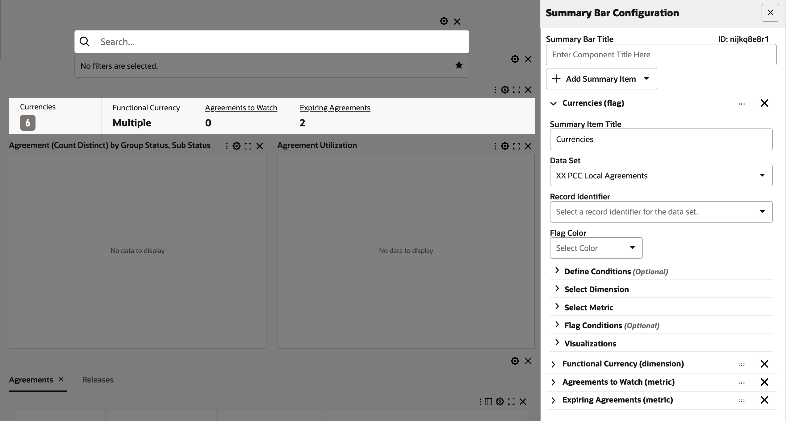 

8.	In “XX Local Agreements” dashboard, remove the entire tab layout component which contains the result tables
         

9.	Create a new tab layout with an empty title and configure 2 tabs:
    * Agreements
    * Releases
         

10.	Under “Agreement” tab, add a “Result Table” component and configure as mentioned below:
    * Title: <Empty>
    * Dataset: 
                         ```
  	    <copy>XX PCC Local Agreements</copy>
            ```
    * Record Identifier: 
                         ```
  	    <copy>Agreement Number</copy>
            ```
    * Attributes:
        * Agreement
        * Document type
        * Supplier
        * Supplier Site
        * Status
        * Group Status
        * Sub Status
        * Agr Amount Limit
        * Agr Supplier Contact

11.	Click on the “Save” button to save the configuration
        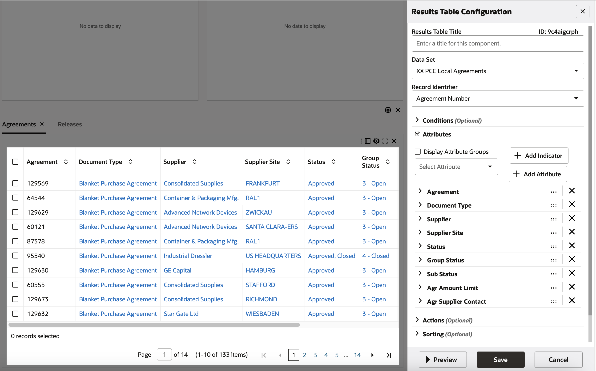 

11.	Under “Releases” tab, add a “Result Table” component and configure as mentioned below:
    * Title: <Empty>
    * Dataset: 
                             ```
  	    <copy>XX PCC Local Agreements</copy>
            ```

    * Attributes:
        * Enable “Display Attribute Groups” checkbox
        * Add below groups (under Interchangeable Attributes section):
            * Release Quantity
            * Releases
            * Release Amount
        * Add below attributes (under Persistent Attributes section):
            * Agreement Number
            * Agreement Line
            * Release Number
            * Po Shipment Num

12. You will see the below image:
        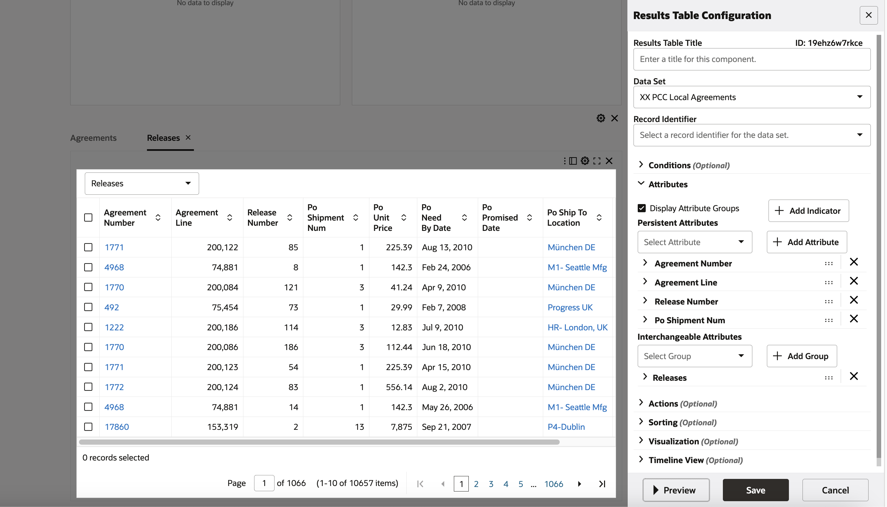

13.	We have successfully created the dashboard for local agreements.
        

## Task 5:	Create data load package

**Data Load Process:**
</br>
As mentioned earlier, ECC uses PL/SQL packages to run the data load process. Here the process to create the data load package for “FULL LOAD” is explained below:

1. Create data load package to run Full Load for Local Agreements custom dataset:

    * The user need to create a PL/SQL package (specification and its respective body) with a procedure, which is required to execute FULL LOAD for xx-po-pcc-local-agreements dataset
    * Sample PL/SQL package files are provided in the Lab Files section
        * Specification: XX\_PO\_PCC\_LOC\_AGR\_UTIL\_PVT.pls
                

        * Body: XX\_PO\_PCC\_LOC\_AGR\_UTIL\_PVT.plb
                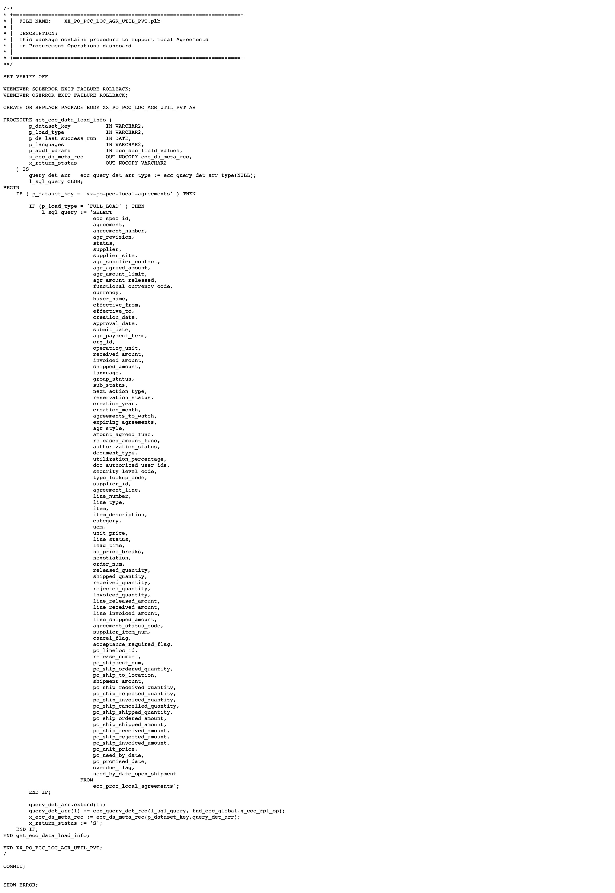


2.	The procedure used for the data load must have below IN and OUT parameters:


<!DOCTYPE html>
<html>
<head>
<style>
table {
  font-family: arial, sans-serif;
  border-collapse: collapse;
  width: 100%;
}

td, th {
  border: 1px solid #dddddd;
  text-align: left;
  padding: 8px;
}

tr:nth-child(even) {
  background-color: #dddddd;
}
style="white-space:pre-wrap; word-wrap:break-word"
</style>
</head>
<body>


<table>
  <tr>
    <th>Parameter Type</th>
    <th>Parameter Name</th>
    <th>Details</th>
  </tr>

  <tr>
    <td>IN</td>
    <td>p_dataset_key</td>
    <td>Represents the data sets for which the data load is being run</td>
  </tr>
    
  <tr>
    <td>IN</td>
    <td>p_load_type</td>
    <td>Signifies which type of data load is being run</td>
  </tr>
  <tr>
    <td>IN</td>
    <td>p_ds_last_success_run</td>
    <td>Signifies the last time the data load got ran successfully</td>
  </tr>
  <tr>
    <td>IN</td>
    <td>p_languages</td>
    <td>Specifies the languages for which the dataload is going to be run</td>
  </tr>
  <tr>
    <td>IN</td>
    <td>p_addl_params</td>
    <td>A parameter via which additional details can be passed to the procedure</td>

  </tr>
  <tr>
    <td>OUT</td>
    <td>x_ecc_ds_meta_rec</td>
    <td>Contains the final data load query that will be executed by ECC</td>
  </tr>
  <tr>
    <td>OUT</td>
    <td>x_return_status</td>
    <td>Returns the status of the load</td>
  </tr>


</table>
</body>
</html>


3.	Compile the package using following steps:
    * Go back to the Terminal window
 
    * Source the EBS edition using below command:
                                         ```
  	    <copy>source /u01/install/APPS/EBSapps.env run</copy>
            ```
    * The package specification is where you declare the public items like procedures, functions etc
                                         ```
  	    <copy>vi /u01/live_labs/11470/lab_files/lab5/task5/XX_PO_PCC_LOC_AGR_UTIL_PVT.pls</copy>
            ```
    * The package body has the definition of every cursor or subprogram like procedures, functions etc. which are declared in the package specification
                                         ```
  	    <copy>vi /u01/live_labs/11470/lab_files/lab5/task5/XX_PO_PCC_LOC_AGR_UTIL_PVT.plb</copy>
            ```
    * Connect to EBS Database using below command:
                                         ```
  	    <copy>sqlplus apps/apps</copy>
            ```

    * The package specification and body files are present under “/u01/live\_labs/11470/lab\_files/lab5/task5”  directory

    * Compile the package using below commands:
                                                 ```
  	    <copy>@/u01/live_labs/11470/lab_files/lab5/task5/XX_PO_PCC_LOC_AGR_UTIL_PVT.pls</copy>
            ```
                                                         ```
  	    <copy>@/u01/live_labs/11470/lab_files/lab5/task5/XX_PO_PCC_LOC_AGR_UTIL_PVT.plb</copy>
            ```
    

4.	Once the package specification and the body are compiled successfully, then the user need to configure the data load rules for the respective dataset
    * Navigate to ECC Developer page
    * Go to “Datasets” menu under “Data Designer” section
    * Search for the local agreements dataset 
                                                             ```
  	    <copy>xx-po-pcc-local-agreements</copy>
            ```
    * Click on the Edit icon
    * Click on the “Load Rules” tab and add below details to configure FULL LOAD
        * Load Type: Full Load
        * Package Name: 
                                                                     ```
  	    <copy>XX_PO_PCC_LOC_AGR_UTIL_PVT</copy>
            ```
        * Procedure Name: 
                                                                             ```
  	    <copy>get_ecc_data_load_info</copy>
            ```
        * Connection Name: ebsdb
            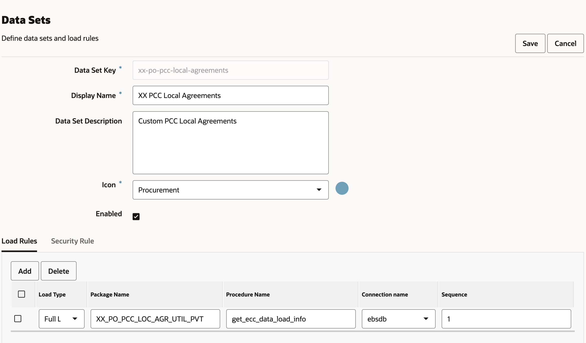
    * Click on the “Save” button
    * Navigate to “Data Load Submission” menu
    * Provide the below details to submit a full load for the local agreements dataset
        *	Application Name: Procurement
        *   Dataset: 
                                                                                     ```
  	    <copy>XX PCC Local Agreements</copy>
            ```
        *	Load Type: Full Load
        *	Click on the “Submit” button

            

    * This will submit a “Full Load” for the custom dataset and inturn uses the created PL/SQL package
    * Click on the Request ID to track the submitted data load job
            
    * Once the data load is successful, click on the “Query Details” link to view more details
            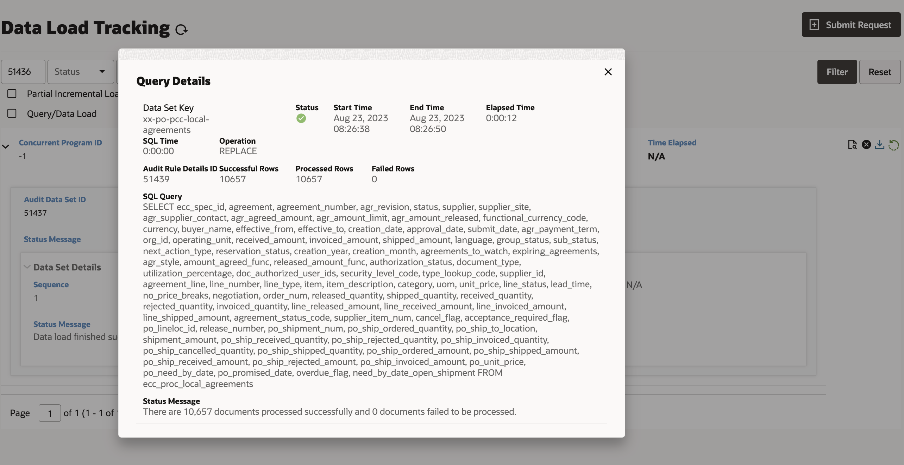
    * The number of successful rows will match the successful row count of Query Upload
    * Navigate to the Local Agreements dashboard (ECC Developer -> Procurement -> XX Local Agreements)
            


## Task 6:	Create security handler 

**Security Rules:** 
</br>
* At the time of creating the dataset, the security handler and privilege details are mandatory. So, the user has provided the names of the packages/privileges, which will be created at later point.

* Security handler also uses PL/SQL package to get the security identifiers which will be applied to the dataset to get the required subset of data – which the user is allowed to see.

* Here, the process to create the security rules for xx-po-pcc-local-agreements dataset is explained below:

    * Create a PL/SQL package with a procedure, which is required to add security filters based on the logged in user and organization.
    * Sample PL/SQL package files are provided in the Lab Files section
        * Specification: XX\_PO\_PCC\_DATASECURITY\_PKG\_PUB.pls
            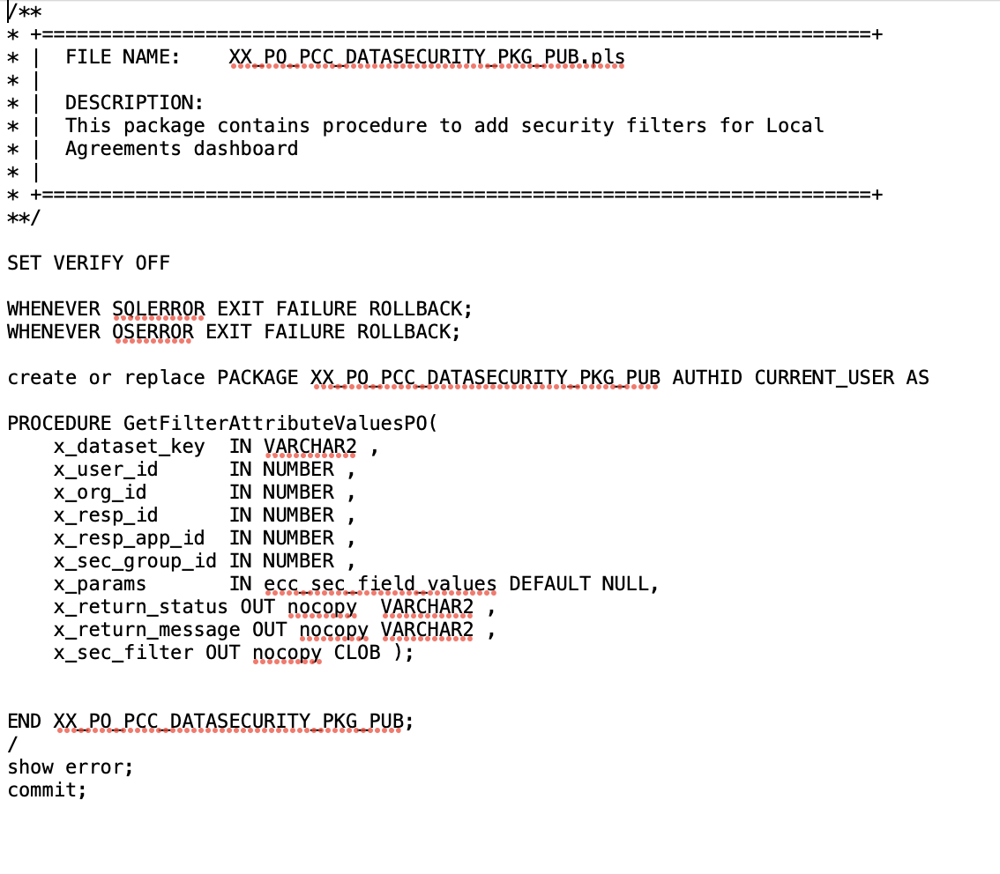

    * Body: XX\_PO\_PCC\_DATASECURITY\_PKG\_PUB.plb
            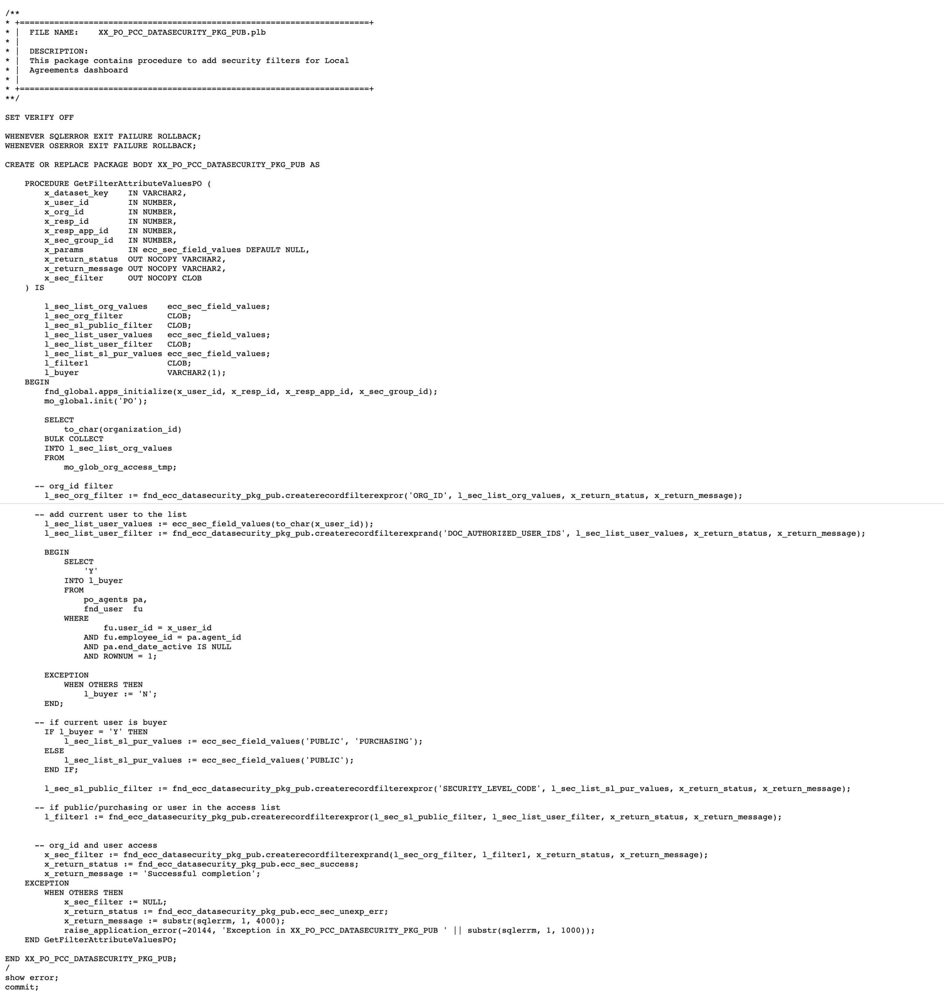

    * This security handler procedure contains below security rules:
        * ORG\_ID in (ORG\_ID1, ORG\_ID2, ORG\_ID3…) for that specific user
        * DOC\_AUTHORIZED\_USER\_IDS = Logged\_In\_User\_ID
        * If the logged in user is a “Buyer”, then SECURITY\_LEVEL\_CODE in ('PUBLIC', 'PURCHASING'), or else, then SECURITY\_LEVEL\_CODE = 'PUBLIC'

* The final security filter which will be generated and returned to ECC will be:
ORG_ID in (ORG\_ID1, ORG\_ID2, ORG\_ID3…) 
AND 
(SECURITY\_LEVEL\_CODE = 'PUBLIC' OR DOC\_AUTHORIZED\_USER\_IDS = Logged\_In\_User\_ID)

* This security filter will be applied on top of the dataset so that the user will be able to see the designated subset of data only.

    * The procedure used for the data load have below IN and OUT parameters:


    <!DOCTYPE html>
<html>
<head>
<style>
table {
  font-family: arial, sans-serif;
  border-collapse: collapse;
  width: 100%;
}

td, th {
  border: 1px solid #dddddd;
  text-align: left;
  padding: 8px;
}

tr:nth-child(even) {
  background-color: #dddddd;
}
style="white-space:pre-wrap; word-wrap:break-word"
</style>
</head>
<body>


<table>
  <tr>
    <th>Parameter Type</th>
    <th>Parameter Name</th>
    <th>Details</th>
  </tr>

  <tr>
    <td>IN</td>
    <td>x_dataset_key</td>
    <td>Represents the data set that the dashboard is using</td>
  </tr>
    
  <tr>
    <td>IN</td>
    <td>x_user_id</td>
    <td>Logged in User ID</td>
  </tr>
  <tr>
    <td>IN</td>
    <td>x_org_id</td>
    <td>Organization ID which is used to access the dataset</td>
  </tr>
  <tr>
    <td>IN</td>
    <td>x_resp_id</td>
    <td>Responsibility ID which is used to access the dataset</td>
  </tr>
  <tr>
    <td>IN</td>
    <td>x_resp_add_id</td>
    <td>Application ID to which the responsibility belongs</td>
  </tr>
  <tr>
    <td>IN</td>
    <td>x_sec_group_id</td>
    <td>ID of the security group</td>
  </tr>
  <tr>
    <td>IN</td>
    <td>x_params</td>
    <td>Additional parameters</td>
  </tr>
  <tr>
    <td>OUT</td>
    <td>x_return_status</td>
    <td>status of the data security execution</td>
  </tr>
  <tr>
    <td>IN</td>
    <td>x_return_message</td>
    <td>x_return_message would contain return the error message in case the x_return_status is 'UNEXPECTED ERROR' or 'EXPECTED ERROR'</td>
  </tr>
    <td>OUT</td>
    <td>x_sec_filter</td>
    <td>x_sec_filter would have the final filter as a json string which be a return value of the call to the methods in ecc_datasecurity_pkg</td>
  </tr>
</table>
</body>
</html>

* Once the changes are completed, compile the package using following steps:
    * Go back to the Terminal window
    * Source the EBS edition using below command:
                                                                                     ```
  	    <copy>source /u01/install/APPS/EBSapps.env run</copy>
            ```
    * Connect to EBS Database using below command:
                                                                                         ```
  	    <copy>sqlplus apps/apps</copy>
            ```
    * The package specification and body files are present under “/u01/live\_labs/11470/lab\_files/lab5/task6”  directory

    * Compile the package using below commands:
                                                                                     ```
  	    <copy>@/u01/live_labs/11470/lab_files/lab5/task6/XX_PO_PCC_DATASECURITY_PKG_PUB.pls</copy>
            ```
                                                                                     ```
  	    <copy>@/u01/live_labs/11470/lab_files/lab5/task6/XX_PO_PCC_DATASECURITY_PKG_PUB.plb</copy>
            ```

        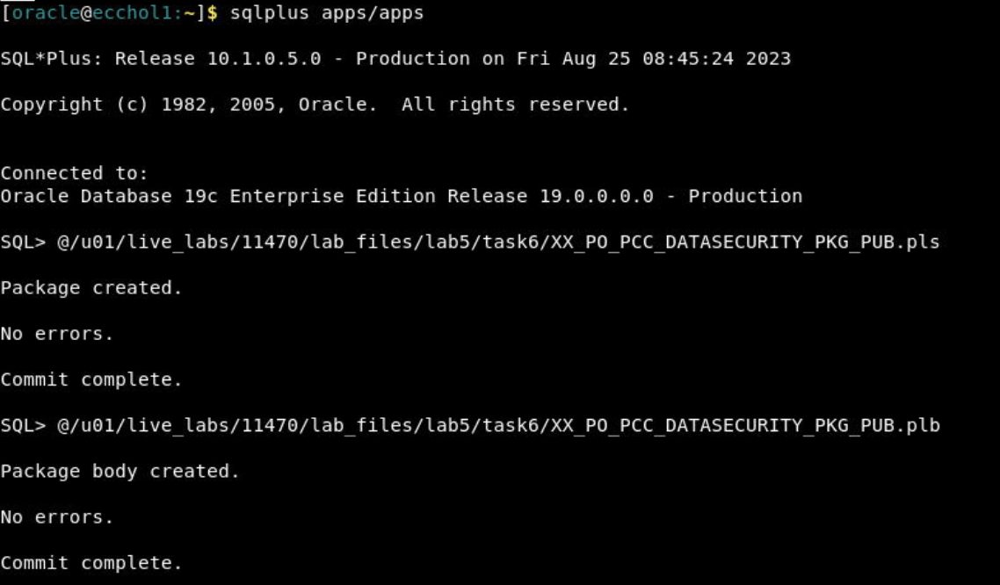

* Once the package specification and the body are compiled successfully, then the user need to configure the data load rules for the respective dataset
    * Navigate to ECC Developer page
    * Go to “Datasets” menu under “Data Designer” section
    * Search for the local agreements dataset 
                                                                                         ```
  	    <copy>xx-po-pcc-local-agreements</copy>
            ```
    * Click on the Edit icon
    * Click on the “Security Rule” tab
    * Provide the security handler name as “XX\_PO\_PCC\_DATASECURITY\_PKG\_PUB.GetFilterAttributeValuesPO”
    * Enable the “Enabled” checkbox. This will ensure that the security rules are applied before accessing the data.

        
    * Click on the “Save” button
    * Navigate to the XX Local Agreements dashboard
        * The dashboard will error out stating that the user is not authorized to access the dataset using the logged in responsibility
        * This is because, we have added Privilege to the dataset that only the users accessing the dashboard using XX\_PO\_PCC\_ECC\_LOCAL\_AGREEMENTS page, can access the dataset

        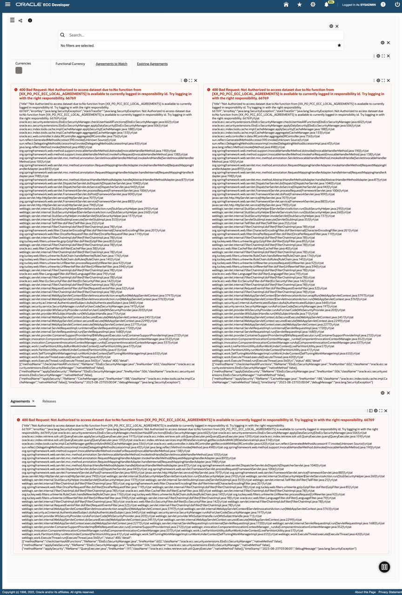

* If any user accesses the local agreements dashboard using the allowed responsibility/page, then the user will be able to view only the designated subset of data. Hence ensuring data security.
        


You may now **proceed to the next lab**


## Learn More
* [Enterprise Command Center- User Guide](https://docs.oracle.com/cd/E26401_01/doc.122/e22956/T27641T671922.htm)
* [Enterprise Command Center- Administration Guide](https://docs.oracle.com/cd/E26401_01/doc.122/f34732/toc.htm)
* [Enterprise Command Center- Extending Guide](https://docs.oracle.com/cd/E26401_01/doc.122/f21671/T673609T673618.htm)
* [Enterprise Command Center- Installation Guide](https://support.oracle.com/epmos/faces/DocumentDisplay?_afrLoop=264801675930013&id=2495053.1&_afrWindowMode=0&_adf.ctrl-state=1c6rxqpyoj_102)
* [Enterprise Command Center- Direct from Development videos](https://learn.oracle.com/ols/course/ebs-enterprise-command-centers-direct-from-development/50662/60350)
* [Enterprise Command Center for E-Business Suite- Technical details and Implementation](https://mylearn.oracle.com/ou/component/-/117416)

## Acknowledgements

* **Author**- Muhannad Obeidat, VP

* **Contributors**-  Muhannad Obeidat, Nashwa Ghazaly, Mikhail Ibraheem, Rahul Burnwal, Manikanta Kumar and Mohammed Khan

* **Last Updated By/Date**- Mohammed Khan, August 2023

